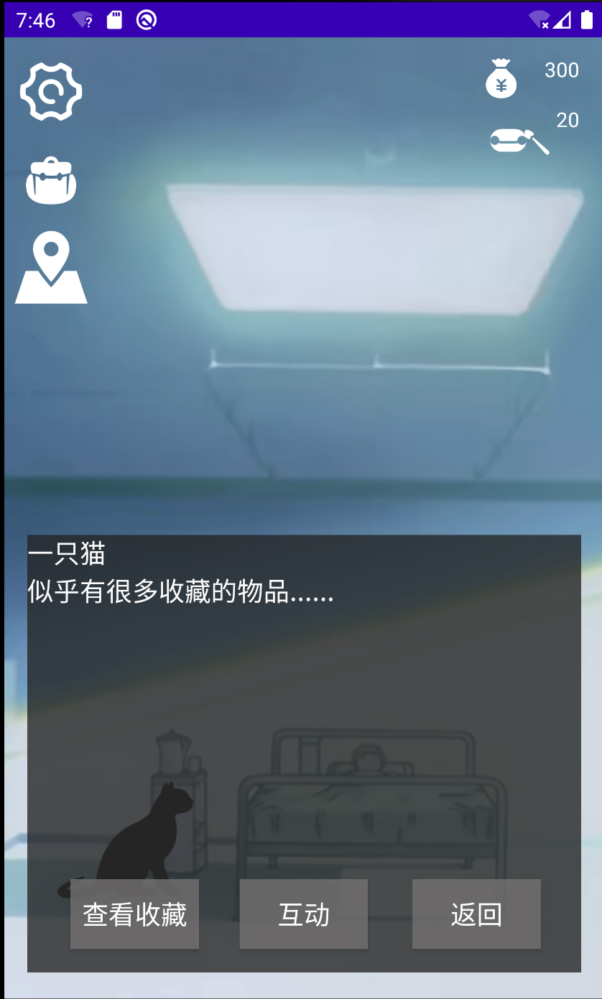

# 介绍

这是一个基于 Android Studio 与 Java 的 Android 端的小游戏，可以看作结合 RPG 与 GalGame 模式的解密攻略类游戏， 包含背包系统、地图系统、交易系统、存档系统等。

虽然比较粗糙，但属于是第一个自己正经做完的玩意，所以记录一下

# 游戏流程

可以看作一个密室逃脱游戏，期间需要根据手里的资源购买道具，攻略NPC，达到条件后可获得解谜通关的关键道具之一，其他道具可以在商店买。

## 主菜单

有三个选项：

- 【开始游戏】：开始一轮新的档
- 【继续游戏】：读取上次的本地存档并继续
- 【设置】：进入设置界面

### 【开始游戏】

刚进入游戏会有个比较中二的介绍，会一行一行跳出来，看完后点击屏幕任意处就可以继续了。

### 【继续游戏】

就直接进入游戏，不看背景介绍了。

### 【设置】

主要有三个功能：

- 【音乐开关】：字面意思，开关音乐
- 【存档】：保存当前状态，下次【继续游戏】可以读取
- 【返回主菜单】：返回主菜单

## 正式开始后的布局

左边三个是跳转

右边是游戏状态值

## 场景介绍

### 场景一：宿舍

类似于出生地的地方，这个猫就是需要攻略的NPC

### 场景二：商店

有各种道具可以买，有的可以用来攻略NPC

### 场景三：实验室

相当于最终密室，这里有通关的线索

## 游戏系统

### 背包系统

显示相关物品，点击盲盒可以开启

### 地图系统

点击红色的坐标后

